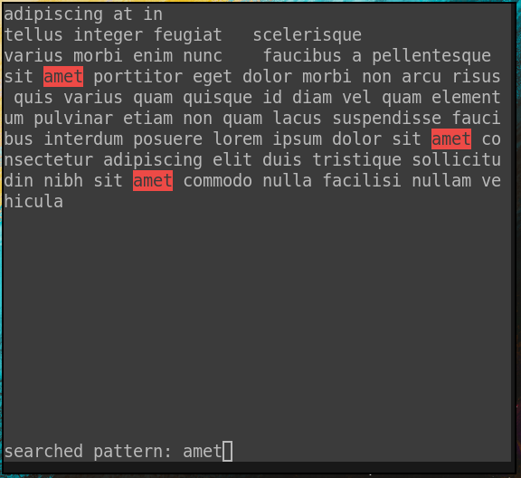
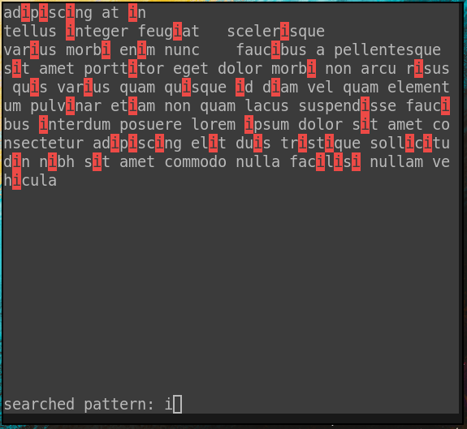
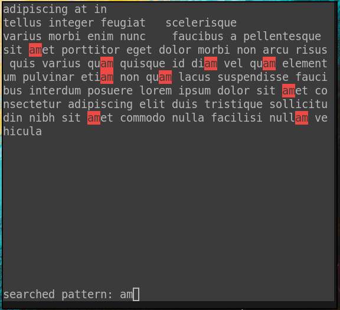

# strs (String search)

Real-time implementation of string search algorithm using [Suffix tree](https://en.wikipedia.org/wiki/Suffix_tree)

## Building and running
You need `ncurses` installed in your computer to build this software.

Execute the build.sh file (uses make and cmake) and then execute the generated binary (you can move to /usr/local/bin/ to use it globally).
```console
$ ./build.sh
$ ./strs FILE_PATH
```

## Demos




